# Introduction and Goals
[Nightscout](http://www.nightscout.info/) is an effort by the open source community to make it easier to visualize diabetes treatment data in a way that lets any device or system contribute data while letting any other device or system retrieve data. Each instance of Nightscout is customized to the patient and serves as a central point of data aggregation in the cloud. Many people who work on Nightscout are part of the [#WeAreNotWaiting](https://openaps.org/) community. Allowing users to control their data gives them more flexibility to treat themselves the way they see fit and gives parents of children a better window into their child's health. To date, insulin pumps, continuous glucose monitors, and other medical devices lock data into proprietary formats, protocols, and web sites, limiting the user's ability to view and manipulate their data in more meaningful ways.

[Medtronic](http://www.medtronicdiabetes.com/), which claims to be the most prescribed pump brand, is one such company that makes insulin pumps with integrated continuous glucose monitoring. The insulin pump stores treatment data as well as sensor and meter calibration data on the device. Unlike some devices which use Bluetooth or a USB port to upload data to a web site, in this case the [CareLink treatment site](https://carelink.minimed.com/patient/entry.jsp), Medtronic uses a proprietary radio protocol and the [CareLink USB stick](https://medtronicdiabetes.secure.force.com/store/remotes-parts/carelink-usb-device/usb-wireless-upload-device), a similarly proprietary device. The site doesn't allow users to download or otherwise obtain the raw data uploaded from their devices nor do they allow you to delete your data from the site. To make matters worse, the data upload and device interaction process is done using a Java applet. They do not publish the protocol for communicating with the USB stick, the pump, or anything else.

## Project Goals

The [OpenAPS](https://openaps.org/) project emphasizes [DYI as an important aspect](https://diyps.org/2015/03/31/why-the-diy-part-of-openaps-is-important/) of working towards an artificial pancreas, and for operations where devices take action for the user it makes a lot of sense that the user should understand how and why things work in a very deep sense. From the standpoint of strictly getting data out of your devices the emphasis on DIY doesn't need to be quite as big. Getting data out of devices has largely been limited to using Linux-based embedded computers like the Raspberry Pi or Arduino as the host system. By comparison there are many more Windows users in the world who are more familiar with Windows-powered devices (desktops, laptops, phones, and also Raspberry Pi devices) that they can use to access their data. Existing capabilities for the Linux and embedded community are great for the overall effort but at this time there are very few capabilities for the Windows platform.

With the overall goal of helping Windows users and developers - myself included - use the CareLink USB stick on Windows systems, I set out with the following goals:

1. Analyze the Medtronic CareLink portal Java applet
1. Research and analyze any native components that run on Windows
1. Insert inspection functionality between the Java applet and native components
1. Observe the native functions the Java applet uses and the data passed back and forth
1. Use all of the above to directly control the device
1. Bonus: Explore the possibility of other ways to work with the device

At the end of this attempt I'll make some suggestions for Medtronic on ways they can better support the community without incurring the wrath of regulatory bodies.

## Special Thanks
I would like to thank the OpenAPS, #WeAreNotWaiting, and Nightscout communities for their hard work over the past few years and their support and ideas over the past few months. I would also like to specifically thank [Ben West @bewest](https://github.com/bewest/) for his very thorough protocol analysis and [James Matheson @CrushingT1D](https://github.com/CrushingT1D) for giving me a CareLink USB stick to work with for this project.

# Environment, Tools, and Installation
To get started I built a study system with the following tools and materials installed:

1. Windows 10 x64 with Internet Explorer
1. Visual Studio 2015
1. The [Windows 7 SDK](https://www.microsoft.com/en-us/download/details.aspx?id=8279)
1. The [Java JDK](http://www.oracle.com/technetwork/java/javase/downloads/index.html) with JRE version 1.8.0_73-b02 (newer ones will probably work)
1. [JD-GUI](http://jd.benow.ca/) to help with analysis of the Java applet
1. [Dependency Walker](http://dependencywalker.com/) for some surface-level exploring
1. The [IDA disassembler](https://www.hex-rays.com/products/ida/support/download_freeware.shtml)
1. The USBView utility from the [Windows 10 DDK](https://msdn.microsoft.com/windows/hardware/hh852365.aspx)

Once everything was installed and before doing any analysis I performed one full upload from the pump via the CareLink USB stick to make sure the system worked end-to-end and that all Medtronic drivers, files, and other resources worked as expected. I felt this was especially important because Java is involved and can be flakey. One thing to note is that [Internet Explorer is being phased out](http://www.npr.org/sections/thetwo-way/2015/03/18/393914128/microsoft-is-phasing-out-internet-explorer) in favor of Microsoft Edge in Windows 10. Edge doesn't support Java, which is is a concern as people replace their PCs with machines running Windows 10. The solution is not for Edge to support Java rather than migrate to a technology that isn't Java-based.

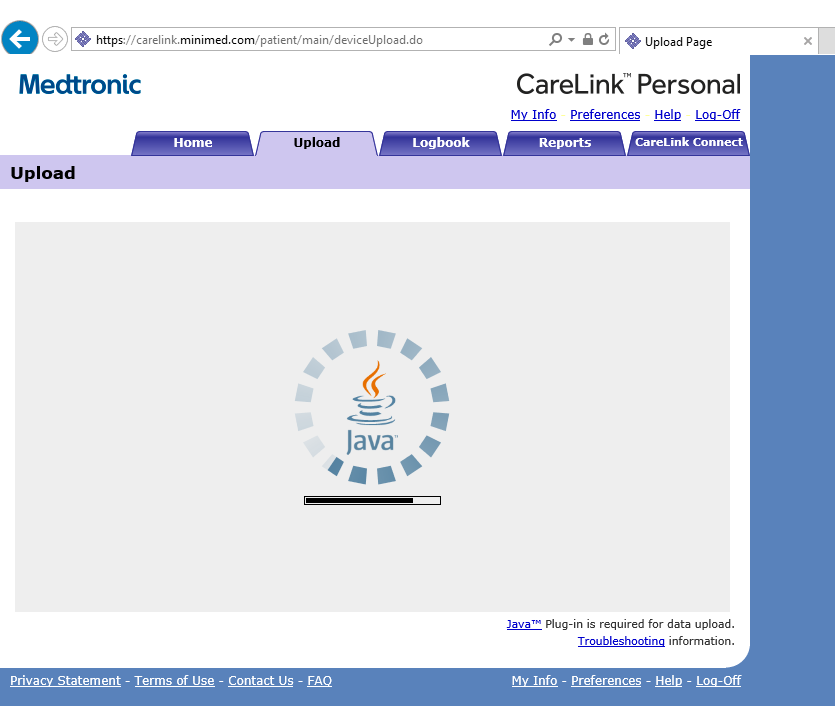

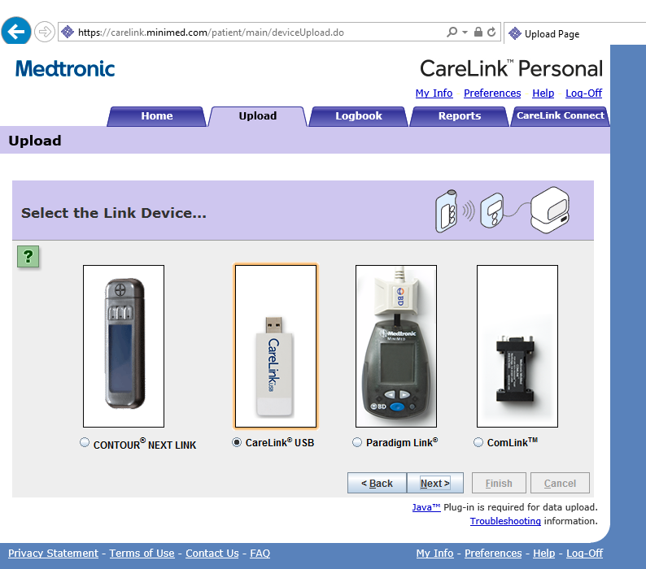

When the applet finishes fully installing its native libraries and drivers they are located in the `C:\ProgramData\` folder. Different versions of Windows will have a slightly different path, but this is the path for Windows 10.

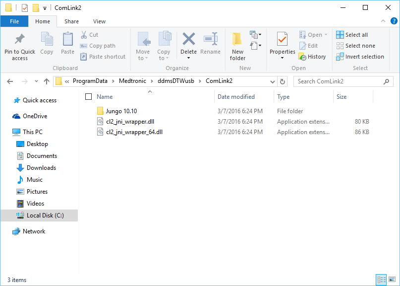

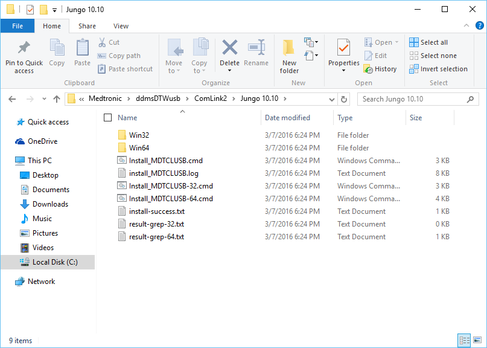

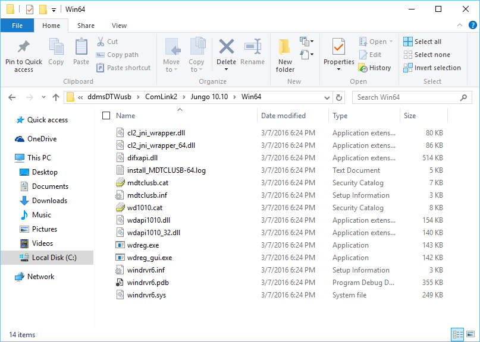

The path above should give you some clues about where to look for resources in the Java applet in the next phase of analysis.

# The Java Applet
The fact that a Java applet is interacting with hardware suggests that [Java Native Interface](http://docs.oracle.com/javase/7/docs/technotes/guides/jni/spec/functions.html) (JNI) components are involved in passing data between the operating system and the applet. Because the applet drives the upload process analyzing it will help you figure out how the native components are used to send and receive data to and from the insulin pump via the CareLink USB stick.

1. Download the applet from their website: 
[https://carelink.minimed.com/applets/ddmsDTWApplet.jar](https://carelink.minimed.com/applets/ddmsDTWApplet.jar)
1. Use JD-GUI to open the applet
1. Notice that the `drivers` package includes sub-packages like `Bayer`, `bd`, `Comlink2`, and `Comlink3` which correspond to the device options given for the initial sync with the Java applet. The `ComLink2` package holds the drivers installed on our PC

The "JNI" string in `cl2_jni_wrapper.dll` confirms our guess that JNI is involved, meaning there's some Java code somewhere in the applet that calls the native functions in this library. The `mdt.common.device.driver.minimed` package has a class name that should look familiar based on the `C:\ProgramData\` directory contents: `JungoUSBPort.class`.

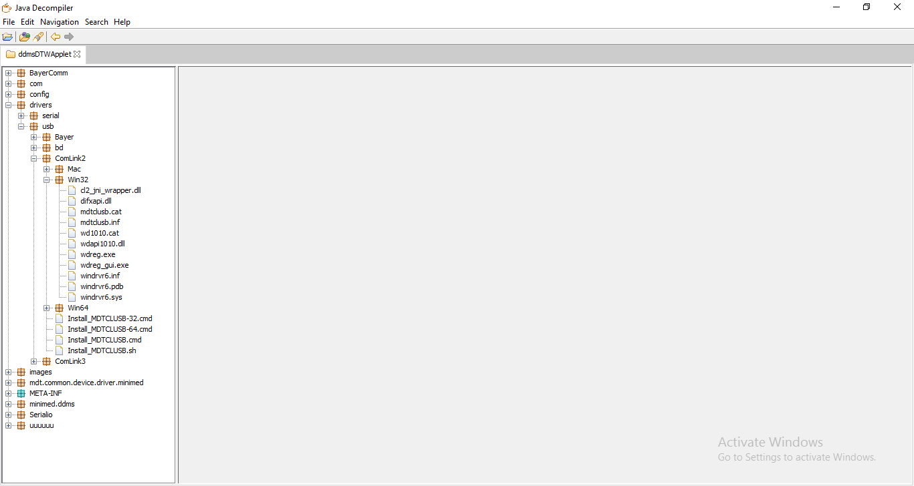

JD-GUI isn't perfect and isn't going to reproduce everything with 100% accuracy so you'll notice some corrupted data, but for the `JungoUSBPort` class it produces output that is correct enough to be useful.

 

The class has helpfully named functions such as `read()` and `write()` so this is probably relevant. These functions call `readNative()` and `writeNative()` and their conciseness makes it pretty easy to tell what the original native function signatures would be based on how they're used:

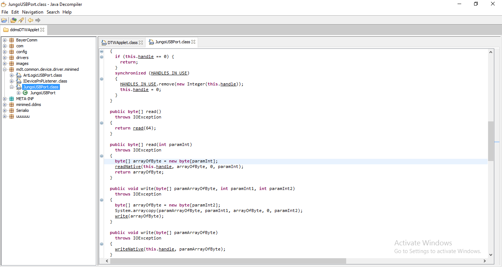

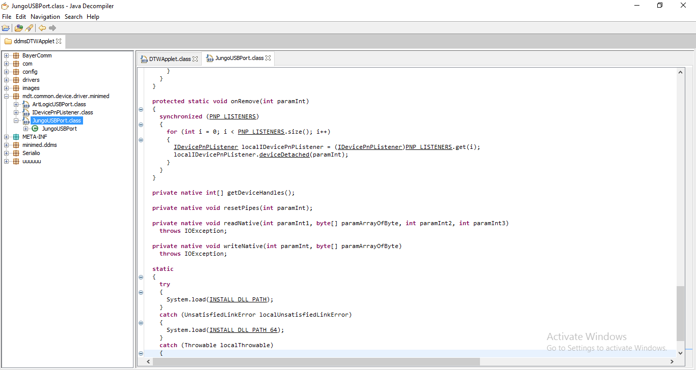

The above information from the applet gives you most of what you need to figure out what functions it uses to send and receive data through the native DLL using JNI.

## JNI Library Exports
With analysis of the applet  done and a way forward identified, open the JNI DLL in Dependency Walker to display what it exports to JNI:

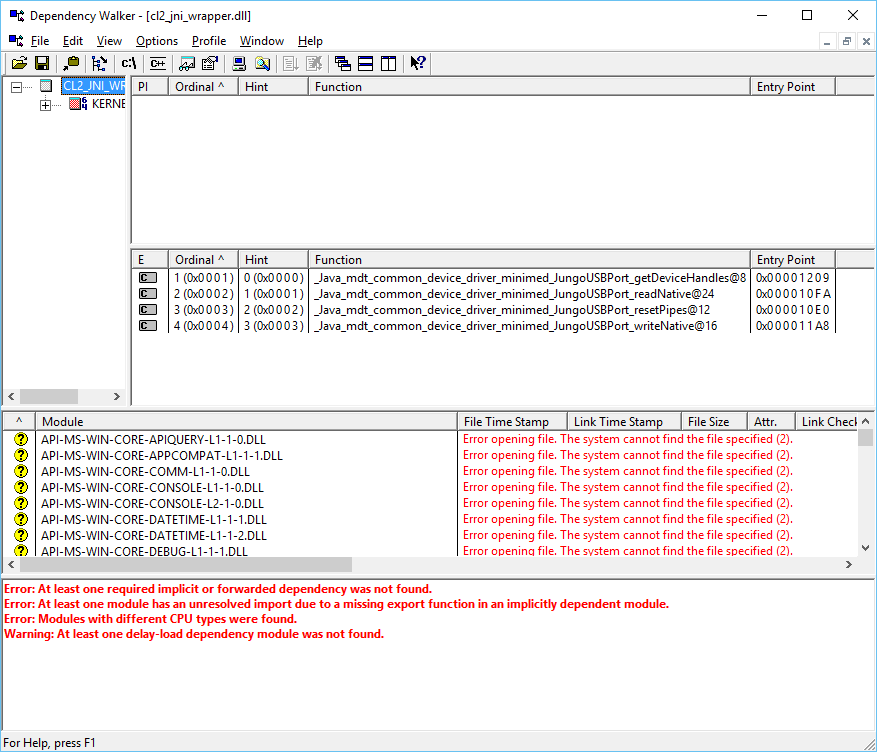

Above is this is the x86 version of the DLL, the x64 version has some slight, but important, differences in function names:


The x86 version of the DLL uses the `_stdcall` calling conversion as opposed to the more common `_cdecl` calling convention. You can tell because of the prepended `_` character and the appended `@##` decoration. The x64 version of the DLL uses the typical `_fastcall` calling convention. Although these semantics seem inconsequential they're important when later attempting to wedge a custom DLL between the Java applet and the Medtronic JNI DLL.

## Explore the JNI Library
Open `cl2_jni_wrapper.dll` in IDA and allow the analysis to run:


`DllMain` doesn't contain anything complicated which means when it's loaded by jp2launcher.exe it doesn't do any initialization. Double-click through to the `_Java_mdt_common_device_driver_minimed_JungoUSBPort_resetPipes` function:

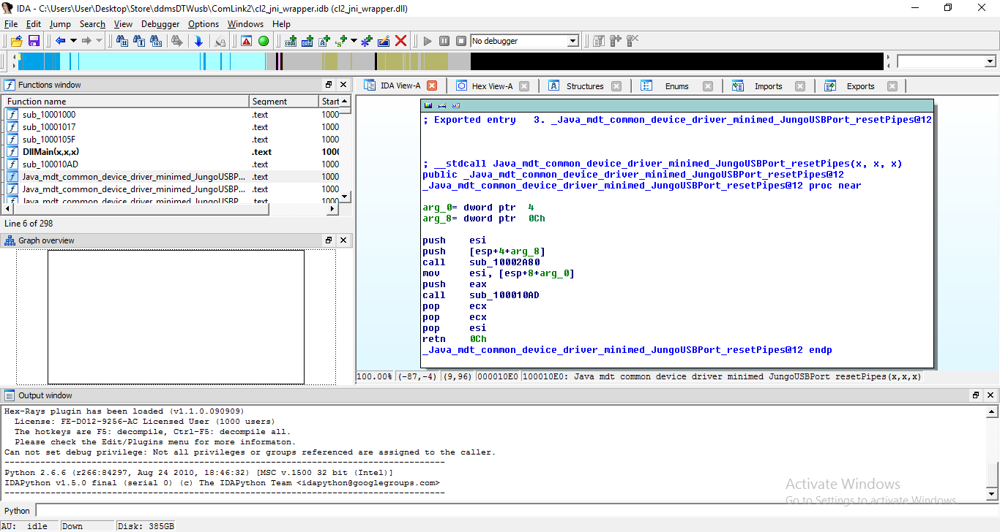

Notice the function takes three parameters instead of the single parameter that the Java applet appears to pass the function. According to the [JNI specification](http://docs.oracle.com/javase/7/docs/technotes/guides/jni/spec/design.html), the first two parameters are a pointer to a `JNIEnv` object and a `this` pointer to the calling object. The third parameter in the native library corresponds to the first parameter that the applet code appears to pass. Clicking the other exported functions shows that `readNative()`, `writeNative()`, and `getDeviceHandles()` all follow the same convention:


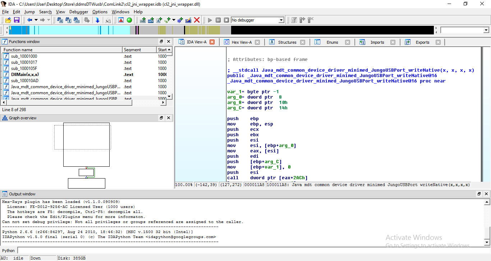


## Function Signatures
Using the above information from JD-GUI, Dependency Walker, IDA, and the JNI specification you have the information you need to infer what parameters are used for and to generate function signatures for the native library. Knowing these function signatures allow you to write a shim library that exposes the same functionality between the Java applet and the JNI library:

```
// Return an array of integers which are handles to the device
jintArray __stdcall Java_mdt_common_device_driver_minimed_JungoUSBPort_getDeviceHandles(JNIEnv *env, jobject obj);

// Resets the pipes associated with the handle, which is retrieved from getDeviceHandles.
void __stdcall Java_mdt_common_device_driver_minimed_JungoUSBPort_resetPipes(JNIEnv *env, jobject obj, int handle);

/* Reads data from the CareLink stick and passes back to the Java applet.
JNIEnv *env: Java JNI environment pointer
jobject obj: Pointer to "this"int handle: Handle from getDeviceHandles()
jbyteArray bytes: An array of allocated bytes, sized to sizeToRead
int paramInt2: Always 0int sizeToRead: The number of bytes to read, which is the allocation size of the bytes parameter */
void __stdcall Java_mdt_common_device_driver_minimed_JungoUSBPort_readNative(JNIEnv *env, jobject obj, int paramInt1, jbyteArray bytes, int paramInt2, int sizeToRead);

/* Writes bytes from the Java applet to the CareLink stick
JNIEnv *env: The Java JNI environment pointer
jobject obj: The this pointer from Java
int handle: Handle to write the bytes to
jbyteArray bytes: Java array of bytes to write to the Carelink stick */
void __stdcall Java_mdt_common_device_driver_minimed_JungoUSBPort_writeNative(JNIEnv *env, jobject obj, int handle, jbyteArray bytes);
```

# Jungo WinDriver
By entering the names of the `windrvr6.sys` driver and its `wdapi1010.dll` helper DLL you can find that they come from [Jungo WinDriver](http://www.jungo.com/st/products/windriver/). WinDriver lets developers focus on writing code to control devices rather than writing drivers, a task that is complex and fraught with security perils. The good news about WinDriver is that Jungo publishes their [development manual](http://www.jungo.com/st/support/documentation/windriver/12.2.0/wdusb_manual.pdf) so we can get a good feel for how the JNI library interacts with it. The bad news about WinDriver is that it's a licensed product, meaning someone would have to pay to use it in the real world. A requirement to purchase expensive tools isn't compatible with the open source model Nightscout and the #WeAreNotWaiting community rely on. As you will see later, this would be a significant set back if the CareLink stick was a more complicated device.

To figure out what the Java applet does a technique called [DLL redirection or DLL proxying](https://dl.packetstormsecurity.net/papers/win/intercept_apis_dll_redirection.pdf) is used to interpose our custom code between the applet and the JNI DLL.

## Library Proxying: CareLinkUSB-Jungo-Proxy
Library proxying is when a library you develop is put between the consumer of a target library and the target library. When the applet attempts to open that target there can't be any differences between the proxy library and the target library. The proxy library must expose the same number of functions and all of these functions must have the same function signatures.

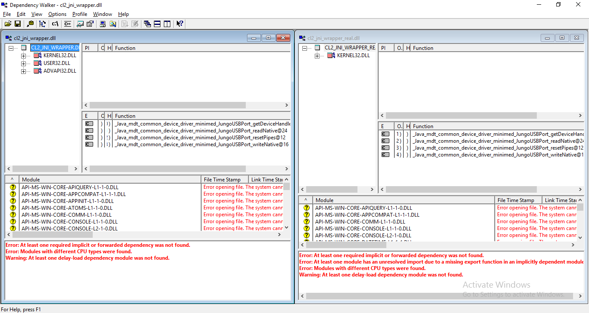

The proxy library loads the target library and calls each target function when the proxy function is called. The proxy function can log or change the parameters to be passed to the target function and can log or change the return values from the target function to the calling function. In this case no changes will be made to any of the parameters or return values. To keep things easy, each proxy function can be boiled down to the same set of steps:

1. Check that the target library is loaded and load it if it isn't. If it loads successfully or it's already loaded, continue. **Note**: When loading the target library using `LoadLibrary()` it's important to load the correctly named DLL for the architecture. Also note when using `GetProcAddress()` that the function names in the x86 DLL are slightly different from the x64 DLL due to the different calling conventions noted above.

1. Call the target function with the same parameters passed to the proxy function.
1. Log any parameters and return values that may be relevant.
1. Return any return values from the target function to the calling function.

The CareLinkUSB-Jungo-Proxy project logs data sent and received via the CareLink stick to a text file. To quickly trace function calls it also outputs some data to the system debugger using `OutputDebugString()` to make it easy to see what functions are being called and in what order. 

Make sure Internet Explorer is closed before installing the proxy DLLs. Once closed, simply rename the target DLLs to include "_real" at the end of the file name and copy the proxy DLLs (the `Log.txt` file will be created later):

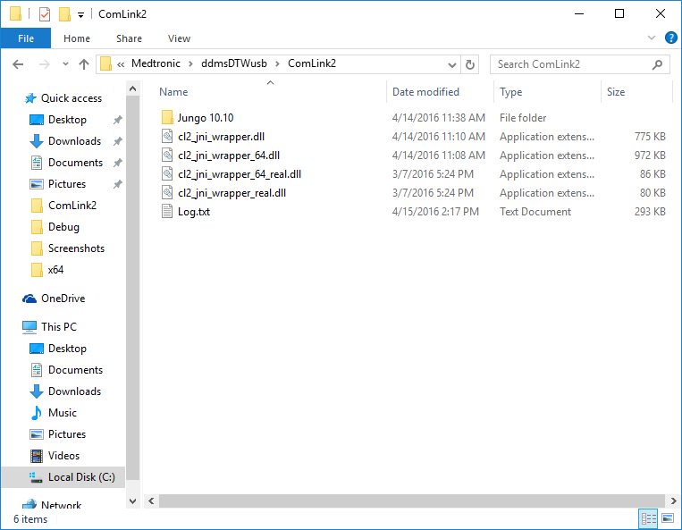

Once installed visit the Medtronic website and start an upload. This will create the `Log.txt` file shown in the above screenshot.

Using any debug output viewing tool you can see that the applet first calls `getDeviceHandles()` to get a handle to the CareLink USB stick, then does a series of `writeNative()` and `readNative()` calls with that handle to get data to and from the stick. `resetPipes()` is called with that handle when an error occurs and the user is prompted to try again. At the end of an upload session the `Log.txt` file saved in `C:\ProgramData\Medtronic\ddmsDTWusb\ComLink2` and contains all of the data sent from the stick to the pump and the responses received. Note that this file should be considered private. In addition to medical data from your pump it includes your pump serial number in the output.

Other modifications were made to the build settings of the CareLinkUSB-Jungo-Proxy project for each platform too:

1. Target Name is `cl2_jni_wrapper` or `cl2_jni_wrapper_64` depending on the architecture
1. Platform Toolset is "Visual Studio 2015 - Windows XP(v140_xp)"
1. The JNI include files are added to Include Directories: `C:\Program Files (x86)\Java\jdk1.7.0_55\include\;C:\Program Files (x86)\Java\jdk1.7.0_55\include\win32;`
1. Runtime Library is "Multi-threaded Debug (/MTd)"
1. the Linker Input field only contains `kernel32.lib`

Now that you can see the data sent between the applet and the JNI library you have a better understanding of what constitutes good and bad data. This lets you define success as you move forward with communicating with the CareLink stick and the pump yourself.

## Send and Receive Data using WinDriver - CareLinkUSB-Jungo-Control
Using the trial version of WinDriver you can play with the software and examine the sample code they provide. Their .NET samples include a USB library that significantly eases development against the native code library in the .NET environment. To bring the `usb_lib_msdev_2008AnyCPU` sample forward from .NET Framework 2.0 to .NET Framework 4.5 some small compatibility modifications had to be made but this gives you the `UsbDevice` and `UsbDeviceManager` classes. Compiling this sample required the provided wdapi_dotnet1010.dll library WinDriver ships with. Since they don't publish source code for that you have to keep track of a version of the library for each of the x86 and x64 architectures.

Once the `usb_lib_dotnet.dll` library is compiled from the sample for each architecture and matched with its corresponding `wdapi_dotnet1010.dll` file consult the `vb_usb_sample` project provided with the Jungo SDK to see what building an application against their library entails. To Jungo's credit, it doesn't take much and that's really great. You need the following pieces to start but their sample code provides just about everything else you would need after defining a few constants:

```
Private Const DEFAULT_VENDOR_ID As UShort = &HA21
Private Const DEFAULT_PRODUCT_ID As UShort = &H8001
Public Const TIME_OUT As Int32 = 30000
```

The `DEFAULT_VENDOR_ID` and `DEFAULT_PRODUCT_ID` above, also known as the VID and PID, correspond to the values the USB stick presents to the operating system when the device is inserted. A 30 second timeout period defined as `TIME_OUT` cuts off read operations that take too long.

Because companies use WinDriver in lieu of creating their own driver they can change the name of the driver. The sample allows you to do this as well. The default name of the driver is `windrvr6` and Medtronic opted not to change that. We can see in IDA that the JNI wrapper includes the string `\\.\windrvr6`, which is what a native library would pass to `CreateFile()` to open the driver for communication:

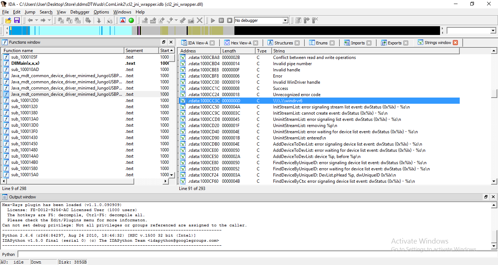

```
Private Const DEFAULT_DRIVER_NAME As String = "windrvr6"
```

Finally, I mentioned that the product is licensed. The documentation states that the license key for the product is passed to `WDU_Init()` to initialize WinDriver and the sample Jungo provides gives you a good idea of what the license key could look like:

```
Private Const DEFAULT_LICENSE_STRING As String = "0123456789abcdef.vendor"
```

It should be noted that even without this information IDA quickly identifies the license key `cl2_jni_wrapper.dll` passes to WinDriver:

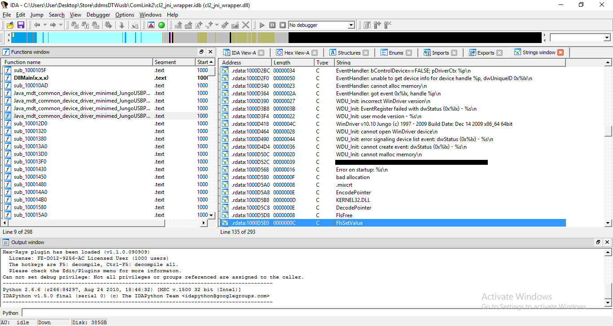


Complicated tools like IDA aren't needed to find the license key in `cl2_jni_wrapper.dll`. It's not obfuscated in any way, and the string is even conspicuous enough that opening `cl2_jni_wrapper.dll` in Notepad makes it pop out. For the purposes of this walk-through I won't identify license key or include it in the sample but the trial version of WinDriver should allow you to work with the project in this repo.

Finally, special attention must be paid to the library versions referenced in the project. Because the `usb_lib_dotnet.dll` and `wdapi_dotnet1010.dll` libraries are platform-specific you must make sure your application architecture and choice of libraries are all the same architecture (x86 or x64) and that they are the correct architecture. Applications and libraries built for the x86 architecture won't run properly on x64, and x64 applications and libraries won't run at all on x86.

Finally, because `wdapi_dotnet1010.dll` is written for .NET Framework 2.0 your application must include an `App.config` file that contains the following compatibility measure:

```
<configuration>
  <startup useLegacyV2RuntimeActivationPolicy="true">
    <supportedRuntime version="v4.0" sku=".NETFramework,Version=v4.0"/>
  </startup>
</configuration>
```

With the above information and based on the sample application provided by Jungo, CareLinkUSB-Jungo-Control opens a command line window and starts by waiting for the CareLink USB stick to be plugged in. Once inserted, or if it was already inserted, it queues a blocking read operation to the USB Bulk Input Pipe on a background thread and then writes two bytes to the USB Bulk Write Pipe. The `0x04 0x00` bytes, which can be seen at the beginning of the `Log.txt` file generated from the CareLink upload process, instruct the CareLink device to return information about itself.

Once the write is complete the USB stick immediately returns the bytes expected based on the CareLinkUSB-Jungo-Proxy log.


The long line of bytes in the above screenshot is the data read from the device in response to the two bytes sent. This demonstrates full control of the device using Jungo WinDriver.

# CareLink USB stick and the WinUSB Driver
Starting with Windows XP Service Pack 2 Microsoft made it easy to write software that communicates with USB devices by releasing the WinUSB driver. WinUSB creates a standard interface across [almost all Windows platforms](https://msdn.microsoft.com/en-us/library/windows/hardware/ff540196(v=vs.85).aspx). This meant hardware developers no longer had to write their own drivers to produce hardware products. WinUSB can used by JNI native libraries as well. Given this scenario and how simple the CareLink USB device I wonder why Medtronic used a proprietary driver instead of using WinUSB. This is exactly the kind of hardware WinUSB was designed for as shown by the USBView tool, with just one bulk input and one bulk output pipe:

```
[Port1]  :  Medtronic CareLink USB


Is Port User Connectable:         yes
Is Port Debug Capable:            no
Companion Port Number:            0
Companion Hub Symbolic Link Name: 
Protocols Supported:
 USB 1.1:                         yes
 USB 2.0:                         yes
 USB 3.0:                         no

Device Power State:               PowerDeviceD0

       ---===>Device Information<===---

ConnectionStatus:                  
Current Config Value:              0x01  -> Device Bus Speed: Full (is not SuperSpeed or higher capable)
Device Address:                    0x05
Open Pipes:                           2

          ===>Device Descriptor<===
bLength:                           0x12
bDescriptorType:                   0x01
bcdUSB:                          0x0200
bDeviceClass:                      0x00  -> This is an Interface Class Defined Device
bDeviceSubClass:                   0x00
bDeviceProtocol:                   0x00
bMaxPacketSize0:                   0x40 = (64) Bytes
idVendor:                        0x0A21 = Physio-Control, Inc.
idProduct:                       0x8001
bcdDevice:                       0x0110
iManufacturer:                     0x00
iProduct:                          0x00
iSerialNumber:                     0x00
bNumConfigurations:                0x01

          ---===>Open Pipes<===---

          ===>Endpoint Descriptor<===
bLength:                           0x07
bDescriptorType:                   0x05
bEndpointAddress:                  0x01  -> Direction: OUT - EndpointID: 1
bmAttributes:                      0x02  -> Bulk Transfer Type
wMaxPacketSize:                  0x0040 = 0x40 bytes
bInterval:                         0x01

          ===>Endpoint Descriptor<===
bLength:                           0x07
bDescriptorType:                   0x05
bEndpointAddress:                  0x82  -> Direction: IN - EndpointID: 2
bmAttributes:                      0x02  -> Bulk Transfer Type
wMaxPacketSize:                  0x0040 = 0x40 bytes
bInterval:                         0x01

       ---===>Full Configuration Descriptor<===---

          ===>Configuration Descriptor<===
bLength:                           0x09
bDescriptorType:                   0x02
wTotalLength:                    0x0020  -> Validated
bNumInterfaces:                    0x01
bConfigurationValue:               0x01
iConfiguration:                    0x00
bmAttributes:                      0x80  -> Bus Powered
MaxPower:                          0x32 = 100 mA

          ===>Interface Descriptor<===
bLength:                           0x09
bDescriptorType:                   0x04
bInterfaceNumber:                  0x00
bAlternateSetting:                 0x00
bNumEndpoints:                     0x02
bInterfaceClass:                   0xFF  -> Interface Class Unknown to USBView
bInterfaceSubClass:                0xFF
bInterfaceProtocol:                0xFF
iInterface:                        0x00

          ===>Endpoint Descriptor<===
bLength:                           0x07
bDescriptorType:                   0x05
bEndpointAddress:                  0x01  -> Direction: OUT - EndpointID: 1
bmAttributes:                      0x02  -> Bulk Transfer Type
wMaxPacketSize:                  0x0040 = 0x40 bytes
bInterval:                         0x01

          ===>Endpoint Descriptor<===
bLength:                           0x07
bDescriptorType:                   0x05
bEndpointAddress:                  0x82  -> Direction: IN - EndpointID: 2
bmAttributes:                      0x02  -> Bulk Transfer Type
wMaxPacketSize:                  0x0040 = 0x40 bytes
bInterval:                         0x01
```

The fact that in Linux the stick is easily used as though it was a serial device, typically mounted to `/dev/ttyUSB0`, also suggests that the device outputs whatever bits it's given and returns whatever bits it receives.

If Medtronic had used the WinUSB driver instead of WinDriver the open source community would have had an easy time controlling the device on the Windows platform using a signed, supported driver. A signed driver is important because although x86 and ARM-IoT platforms allow users to load unsigned drivers the phone/tablet-ARM and x64 platforms don't. This significantly limits the ease with which developers outside of Medtronic can use the CareLink USB stick to access data.

## Replacing the Jungo Driver with the WinUSB Driver
Attempting to use the CareLink stick with the WinUSB driver is straight forward, but requires a lot of manual interaction with the Device Manager. If the device has been used with WinDriver it should be uninstalled which disables the Medtronic applet until you reinstall WinDriver. Further, a Registry modification must be made after forcing the device to use the WinUSB driver and the USB stick must be plugged into the same USB physical port each time or the WinUSB driver won't be loaded.

**Caution**: The following steps can have serious consequences if not done properly. Without significant work this will break your ability to use the Medtronic applet with the CareLink USB stick. Do not perform the following steps unless you know what you're doing or can recover from errors.

1. Uninstall the Medtronic CareLink USB and WinDriver device drivers (if necessary)

   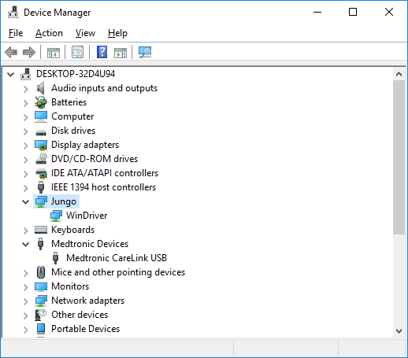

   

1. Rescan the system for new devices

   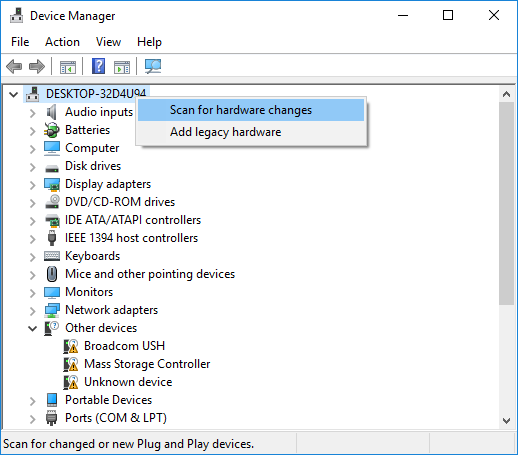

1. After scanning is complete open the new Unknown Device entry and click Update Driver

   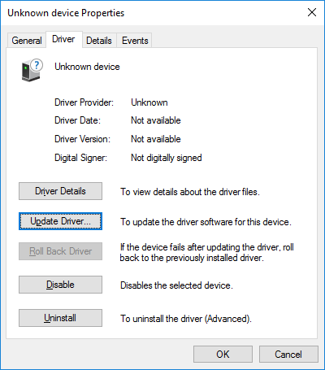

1. Select "Browse my computer for driver software"

   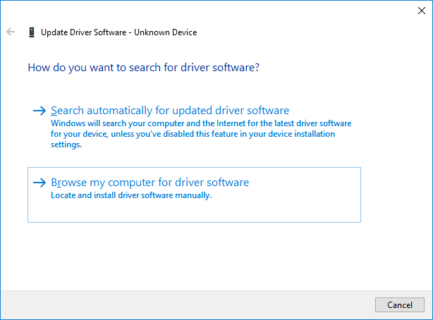

1. Select "Let me pick from a list of device drivers on my computer"

   

1. Select "Show All Devices" in the "Select your device's type from the list below" window

   

1. In the Manufacturer column select "WinUsb Device" and in the Model column select "WinUsb Device," then click Next

   

1. You will see a warning about compatibility. Click Yes to complete the installation.

   

1. The final window will display when installation is successful.

   

Now that the WinUSB driver is associated with the device the interface GUID must be entered manually into the Registry. Under normal circumstances this is something a signed driver [would take care of for you](https://msdn.microsoft.com/en-us/library/windows/hardware/ff540283%28v=vs.85%29.aspx#installing_winusb_by_specifying__the_system-provided_device_class) and it wouldn't matter which port you plugged the device into in the future. Because you're doing this manually the following caveat applies:

> ## Installing WinUSB by specifying the system-provided device class

> The preceding procedure does not add a device interface GUID for an app (Windows Store app or Windows desktop app) to access the device. You must add the GUID manually by following this procedure.

> 1. Load the driver as described in the preceding procedure.

> 1. Generate a device interface GUID for your device, by using a tool such as guidgen.exe. 

> 1. Find the registry key for the device under this key:
`HKEY_LOCAL_MACHINE\SYSTEM\CurrentControlSet\Enum\USB\<VID_vvvv&PID_pppp>`

> 1. Under the Device Parameters key, add a String registry entry named DeviceInterfaceGUID or a Multi-String entry named DeviceInterfaceGUIDs. Set the value to the GUID you generated in step 2.

> 1. Disconnect the device from the system and reconnect it to the same physical port.

> **Note**: If you change the physical port then you must repeat steps 1 through 4. 

With this in mind and using the example screenshot below:

1. If inserted, unplug the CareLink stick from the computer
1. Open the Registry Editor
1. Navigate to `HKEY_LOCAL_MACHINE\SYSTEM\CurrentControlSet\Enum\USB\VID_0A21&PID_8001`
1. Navigate to the next lower key in the tree that has the `Service` value set to `WINUSB`
1. Create a `REG_MULTI_SZ` value with the name `DeviceInterfaceGUIDs` and set it to `{a5dcbf10-6530-11d2-901f-00c04fb951ed}`

   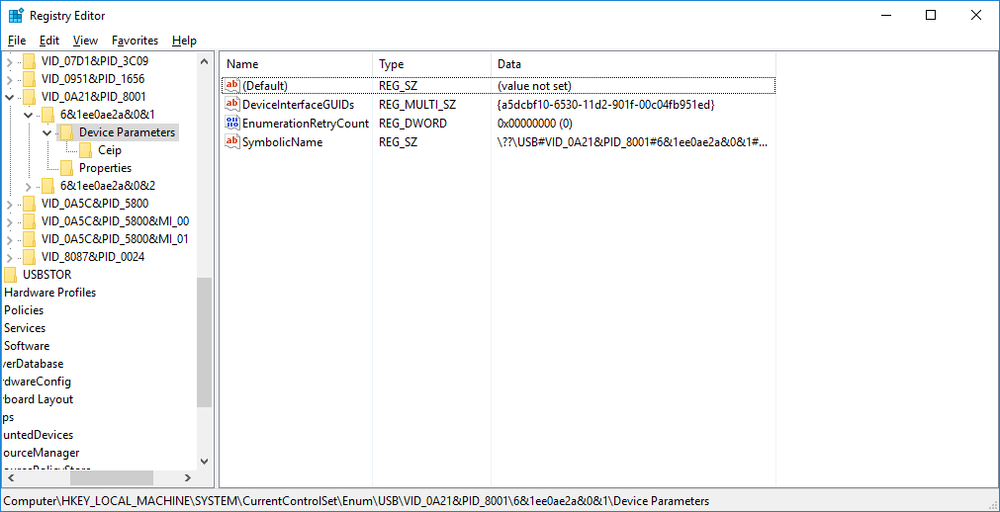

1. Close the Registry Editor
1. Reinsert the CareLink USB stick into the same USB port

Opening the Device Manager should now show that the CareLink USB stick is recognized as a WinUsb Device. The VID and PID of the device will match those for the CareLink stick when it was connected using Jungo WinDriver.

## Use the CareLink USB stick with WinUSB: CareLinkUSB-WinUSB-Control
Now that the CareLink USB stick is usable by any Win32, .NET Framework, or Universal Windows Platform (UWP) application the potential to use the device is  much broader. Although Win32 doesn't have this limitation and .NET Framework apps can do complicated things to overcome it, UWP apps can't work with the Jungo driver because the UWP platform doesn't allow apps to access arbitrary devices and drivers.

When creating a UWP app for a WinUSB device such as CareLinkUSB-WinUSB-Control you will need to declare the USB `DeviceCapability` in your package manifest and ensure that the VID, PID, and WinUSB device interfaces are correct:

```
    <DeviceCapability Name="usb">
      <Device Id="vidpid:0A21 8001">
        <Function Type="winUsbId:a5dcbf10-6530-11d2-901f-00c04fb951ed"/>
      </Device>
    </DeviceCapability>
```

Your UWP app should now be able to find the device when it's attached to the system and control it as could in the CareLinkUSB-Jungo-Control sample. The CareLinkUSB-WinUSB-Control sample demonstrates how to do this quickly and easily:

1. Declare a `WorkItemHandler` function that will process data received from the device
1. Search for the CareLink stick using the VID and PID
1. Obtain a handle to the device with `UsbDevice.FromIdAsync()`
1. Create the `WorkItemHandler` thread, which do partial read operations and block until data is received or the timeout expires
1. Find each `UsbBulkOutPipe` and output the `0x04 0x00` bytes using a `DataWriter`
1. Watch the bytes received from the device show up on the `MainPage`

Changing the driver makes the device much more versitile but without a signed WinUSB driver a lot of manual configuration is required by end-users. The complex steps required eliminate the possibility of a Windows Store app that users can download and use with the CareLink stick without extensive follow-on work.

## Developing a WinUSB Driver for Windows
WinUSB is supported by so many versions of Windows [including Windows IoT](http://stackoverflow.com/questions/33317743/winusb-driver-on-windows-10-iot) and and it doesn't require any software development to support this device. Because of this you can make a [simple, custom driver INF file](https://msdn.microsoft.com/en-us/library/windows/hardware/ff540283%28v=vs.85%29.aspx#inf) to tell Windows which WinUSB device interfaces need to be registered for the CareLink USB stick. Windows users on x86 and IoT-ARM platforms will be able to use this INF file to install the driver and override driver signature warnings from Windows but users on phone/tablet-ARM and x64 platforms won't have that luxury because mantatory driver signing is enforced. In 2010 64-bit installations of Windows were [getting ready to surpass 32-bit installations](http://arstechnica.com/information-technology/2010/07/nearly-half-of-windows-7-installations-are-64-bit/), leading me to believe mandatory driver signing will be a significant hurdle to overcome in the general user community.

For people on x86 and IoT-ARM platforms that don't enforce driver signing I've included a [cross-platform INF file](https://msdn.microsoft.com/en-us/library/windows/hardware/ff540220(v=vs.85).aspx) that allows users to install the driver and interact with the CareLink stick in Win32, .NET Framework, and UWP applications. The INF file will also work on phone/tablet-ARM and x64 platforms if someone signs it. Like all INF files most of it is boilerplate and string references, but here are the important parts:

```
; ========== Manufacturer/Models sections ===========
[Manufacturer]
%ManufacturerName%=Standard,NTx86,NTarm,NTamd64

[Standard.NTx86]
%DeviceName% =USB_Install, USB\VID_0A21&PID_8001

[Standard.NTamd64]
%DeviceName% =USB_Install, USB\VID_0A21&PID_8001

[Standard.NTarm]
%DeviceName% =USB_Install, USB\VID_0A21&PID_8001
```

This tells Windows to match this driver for the VID and PID corresponding to the CareLink USB stick for the three listed architectures (x86, x64, and ARM).

```
[Dev_AddReg]
HKR,,DeviceInterfaceGUIDs,0x10000,"{a5dcbf10-6530-11d2-901f-00c04fb951ed}"
```

This directive installs the device interface GUID that you manually added to the Registry when you overrode the driver. When this Registry value is present the device is automatically detected as a WinUSB device and our Win32, .NET Framework, and UWP apps can interact with it directly.

Finally, for those running Windows 10 for IoT on a Raspberry Pi device you can install the INF file so your IoT apps can interact with the CareLink stick too. Reboot after copying the file to the device and running the following command in PowerShell:

```
devcon dp_add .\Medtronic.inf
```

# Conclusions

The DIY aspect of OpenAPS is important to maintain, but the barrier to entry for new users of Nightscout need not be as high. To open the platform up to more potential users we need easy, point-and-click solutions and a Nightscout uploader in the Windows Store is one step towards that goal. With some devices, including Dexcom CGM readers and Bayer NextLink meters, plugging the device into a Windows PC results in an instantly available interface that doesn't require installation of extra drivers to operate. The Medtronic CareLink USB stick is not one of these devices, resulting in the above research to give us these benefits:

1. A driver installation file to support the Medtronic CareLink USB stick using in-box drivers that come with Windows
1. The ability for Windows developers (Win32, .NET Framework, and Universal Windows Platform) to communicate with Medtronic Minimed devices, moving the Nightscout community towards a Windows-based uploader
1. A method for the [Windows Maker community](https://developer.microsoft.com/en-us/windows/iot) to use the CareLink device on Windows IoT boards such as the Raspberry Pi just as Linux-based Pi developers can today

## Recommendations to Medtronic
1. Obfuscate the Jungo WinDriver license key in the `cl2_jni_wrapper.dll` and `cl2_jni_wrapper_64.dll` libraries.
1. [Publish a signed WinUSB driver INF and CAT file](https://msdn.microsoft.com/en-us/library/windows/hardware/ff540283(v=vs.85).aspx#howto). Alternatively, they can sign the INF file published in this repository with their Software Publishing Certificate and provide the resulting security catalog (.cat) file. Code does not need to be developed or supported to make this work and they gain compatibility on many more platforms for themselves at the same time.
1. Publish documentation for the protocols to communicate with the Medtronic [Minimed](http://www.medtronicdiabetes.com/products/minimed-530g-diabetes-system-with-enlite) and [Minimed Paradigm](http://www.medtronicdiabetes.com/products/minimed-revel-insulin-pump) insulin pumps as well as the communications documentation for the [Minimed Connect](http://www.medtronicdiabetes.com/products/minimed-connect). This would generate a lot of good will in the open source community. Bayer [publishes protocol documentation](http://protocols.glucofacts.bayer.com/) (or will again soon) so why doesn't Medtronic? This should be especially easy for the Minimed Connect given how new it is and the availability of the iOS app.
1. Optionally, rewrite the JNI library to use a WinUSB driver to maintain their ability to upload data and allow more access to the device to other developers at the same time. In a perfect world they would find a way to move away from Java altogether because the [security risks](http://www.usatoday.com/story/tech/columnist/komando/2013/01/31/komando-java-security-alert/1871047/) [are too great](http://www.csoonline.com/article/2875535/application-security/java-is-the-biggest-vulnerability-for-us-computers.html).

## Next Steps
At this point there isn't anything new necessary to work with the CareLink USB stick in Windows. If another organization was to come forward and sign the INF file included in this project that would be an effective alternative to waiting for Medtronic if they're interested in doing that at all. I welcome contact from anyone willing to do this.

This work will be incorporated into a library for a Windows uploader application that will be published in the Windows Store in the future.